# U-Boot（ARMv8 / AArch64）启动流程全解文档

> 适用代码：`start.S`、`board_f.c`、`board_r.c`、`bootm.c`、`main.c`
> 适用架构：Denx U-Boot，ARMv8（AArch64），小端、MMU 关闭、i/d Cache 关闭的复位初态
> 文档目标：① 启动流程图；② 函数调用链（按 5 个文件分 5 段，含两张写死顺序的 INITCALL 列表）；③ `start.S` 寄存器级逐条解读。

---

## 第一部分：启动流程图

下图覆盖已确定的启动时间线，所有分支（PIE 对齐、EL 切换、relocation、autoboot/CLI、FDT/ATAGS）均用 `condition`/`decision` 节点表达。

```mermaid
flowchart TD
    A([上电 / 复位]) --> B[BootROM]
    B --> C["_start (start.S)"]
    C --> D{"有 boot0 头?<br/>CONFIG_LINUX_KERNEL_IMAGE_HEADER<br/>/ ENABLE_ARM_SOC_BOOT0_HOOK"}
    D -- "无特殊头" --> E["b reset"]
    D -- "有头" --> HDR["执行 boot0 头<br/>(linux-kernel-header / arch/boot0.h)"]
    HDR --> E
    E --> F["reset: b save_boot_params"]
    F --> G["save_boot_params_ret"]

    G --> P{"CONFIG_POSITION_INDEPENDENT<br/>且非 XPL?"}
    P -- "否" --> V
    P -- "是" --> Q["adr x0,_start<br/>ands x0,x0,#0xfff"]
    Q --> R{"4KB 对齐?<br/>(低12位==0)"}
    R -- "否(致命)" --> W["wfi → b 0b<br/>(死等)"]
    R -- "是" --> S["pie_fixup:<br/>遍历 .rela.dyn 做 PIE 重定位<br/>x9 = 运行地址 − 链接地址"]

    S --> V
    V["set_vbar 宏准备<br/>adr x0, vectors"] --> EL{"switch_el x1, 3f,2f,1f<br/>当前异常等级 EL?"}
    EL -- "EL3" --> E3["set_vbar vbar_el3,x0<br/>SCR_EL3 |= NS|IRQ|FIQ|EA<br/>CPTR_EL3 = 0<br/>(开 FP/SIMD)"]
    EL -- "EL2" --> E2["HCR_EL2 路由 SError<br/>set_vbar vbar_el2,x0<br/>CPTR_EL2 = 0x33ff"]
    EL -- "EL1" --> E1["set_vbar vbar_el1,x0<br/>CPACR_EL1 = 3<<20<br/>(开 FP/SIMD)"]
    E3 --> DAIF
    E2 --> DAIF
    E1 --> DAIF
    DAIF["msr daifclr,#0x4<br/>(unmask SError)"]

    DAIF --> CF{"CONFIG_COUNTER_FREQUENCY<br/>且为最高 EL?"}
    CF -- "是" --> CN["msr cntfrq_el0, freq"]
    CF -- "否" --> SM
    CN --> SM["isb"]
    SM --> SMP{"CONFIG_ARMV8_SET_SMPEN?"}
    SMP -- "是(仅EL3)" --> SMPEN["S3_1_c15_c2_1 |= 0x40<br/>(置 SMPEN 多核一致性)"]
    SMP -- "否" --> ER
    SMPEN --> ER["isb"]

    ER --> AERR["bl apply_core_errata<br/>(A53/A57 勘误)"]
    AERR --> LLI["bl lowlevel_init<br/>(GIC 中断控制器初始化)"]
    LLI --> MP{"多核策略?<br/>spin-table / ACPI /<br/>MULTIENTRY / 单核"}
    MP -- "从核" --> SLAVE["slave_cpu: wfe 自旋<br/>轮询 CPU_RELEASE_ADDR<br/>被唤醒后 br x0"]
    MP -- "主核" --> MASTER["master_cpu"]

    MASTER["master_cpu:<br/>msr SPSel,#1 (用 SP_ELx)"] --> MAIN["bl _main (crt0.S)<br/>建 gd / early malloc"]
    MAIN --> BIF["board_init_f()<br/>(board_f.c)"]
    BIF --> ICF["initcall_run_f()<br/>早期初始化 + 内存预留"]
    ICF --> RELOC{"relocation<br/>(ARM 上由 crt0.S 完成)"}
    RELOC -- "crt0.S 搬自身到 RAM 顶" --> BIR["board_init_r()<br/>(board_r.c)"]
    BIR --> ICR["initcall_run_r()<br/>缓存/DM/环境/存储/控制台"]
    ICR --> RML["run_main_loop() → main_loop()<br/>(main.c)"]

    RML --> AUTO{"autoboot 倒计时<br/>有无按键打断?"}
    AUTO -- "超时自动" --> ACMD["autoboot_command(s)<br/>执行 bootcmd"]
    AUTO -- "按键打断" --> CLI["cli_loop()<br/>(交互式命令行)"]
    AUTO -- "CONFIG_BOOTSTD_PROG" --> BSB["bootstd_prog_boot()<br/>(标准启动 bootflow)"]

    ACMD --> BOOTM["do_bootm_linux()<br/>(bootm.c)"]
    CLI --> BOOTM
    BSB --> BOOTM

    BOOTM --> PREP["boot_prep_linux()"]
    PREP --> FMT{"有 FDT 且支持 LMB?"}
    FMT -- "FDT" --> FDT["image_setup_linux()<br/>修正设备树"]
    FMT -- "ATAGS" --> ATAGS["setup_start_tag →<br/>setup_memory_tags →<br/>setup_commandline_tag →<br/>setup_initrd_tag →<br/>setup_end_tag"]
    FDT --> JUMP
    ATAGS --> JUMP
    JUMP["boot_jump_linux()<br/>cleanup_before_linux"] --> ELX{"目标 EL?<br/>armv8_switch_to_el2/el1"}
    ELX -- "EL2(AArch64/32)" --> KE["跳内核入口 ep<br/>x0=FDT, 不返回"]
    ELX -- "EL1(可选)" --> KE
```



---

## 第二部分：函数调用链

下面按「启动执行顺序」分 5 段，每段列出 `caller → callee` 并标注核心职责。两张写死顺序的 INITCALL 列表完整列出，未省略。

### 2.1 `start.S` —— 汇编早期启动（复位到 C 运行环境）

| 调用关系 | 核心职责（一句话） |
|---|---|
| `_start` → `reset`（`b reset`） | 无 boot0 头时直接跳复位处理；否则先执行 boot0 头 |
| `reset` → `save_boot_params`（`b`，不返回） | 保存 BootROM 传入的 `x0–x3` 关键参数 |
| `save_boot_params` → `save_boot_params_ret`（`b`） | 保存完参数后返回 `reset` 继续后续早期初始化 |
| `save_boot_params_ret` →（PIE 分支）→ `pie_fixup` | 4KB 对齐检查；通过后遍历 `.rela.dyn` 重定位 |
| `pie_fixup_done` → `set_vbar` 宏 / `switch_el` 展开 | 写 VBAR_ELn（异常向量表），按当前 EL 配置系统寄存器 |
| `switch_el` 出口 → `apply_core_errata`（`bl`） | 调用 CPU 勘误修复（A53/A57 等） |
| `apply_core_errata` → `apply_a53_core_errata` / `apply_a57_core_errata` | 按 MIDR 识别核心，跳对应勘误实现 |
| `apply_core_errata` 返回 → `lowlevel_init`（`bl`） | SoC 底层初始化，主要是 GIC 中断控制器 |
| `lowlevel_init` → `gic_init_secure` / `gic_init_secure_percpu` / `gic_kick_secondary_cpus` | 主核初始化 GICD/GICR/GICC；从核发 SGI 唤醒 |
| `lowlevel_init` 返回 → `master_cpu`（`branch_if_master`） | 主核选择 SP_ELx 后进入 `_main` |
| `master_cpu` → `_main`（`bl`，位于 crt0.S） | 建立 gd、early malloc，随后调用 `board_init_f()` |
| `c_runtime_cpu_setup`（`ENTRY`，由 crt0.S 在 relocation 后调用）→ `switch_el` | 重定位后把 VBAR 重新指向 RAM 中新位置的 `vectors` |
| `slave_cpu`（从核自旋）→ `wfe` / `ldr x1,=CPU_RELEASE_ADDR` / `br x0` | 从核轮询释放地址，被主核唤醒后跳到释放地址 |

### 2.2 `board_f.c` —— 第一阶段初始化（relocation 之前）

| 调用关系 | 核心职责（一句话） |
|---|---|
| `_main`（crt0.S）→ `board_init_f(boot_flags)` | 进入 C 语言第一阶段入口；清控制台标志，建 `board_f` 临时结构 |
| `board_init_f` → `initcall_run_f()` | 执行写死顺序的 INITCALL 列表（见下） |
| `initcall_run_f` → `setup_mon_len` … → `setup_reloc` | 早期初始化 + DRAM 探测 + 内存预留 + 偏移计算 |
| `initcall_run_f` →（ARM 不调用）`jump_to_copy` | 非 ARM 架构在此 `relocate_code` 搬自身，ARM 由 crt0.S 完成 |
| `board_init_f` → `show_memory_layout()`（调试打印） | 打印 GD/RAM/栈/malloc/reloc 地址等内存布局 |

**`initcall_run_f()` 完整 INITCALL 顺序（board_f.c，不可随意调整）**：

```
setup_mon_len                // 计算 gd->mon_len（映像代码+数据+BSS 总长）
fdtdec_setup                 //(OF_CONTROL) 定位/配置设备树 gd->fdt_blob
trace_early_init             //(TRACE_EARLY) 早期 trace 初始化
initf_malloc                 // 初始化 early malloc（gd->malloc_ptr）
initf_upl                   //(UPL_IN) 读取 UPL handoff 数据
log_init                    // 日志子系统初始化
initf_bootstage             // 启动计时框架初始化，标记 board_init_f
event_init                  // 事件框架初始化
bloblist_init               //(BLOBLIST) 初始化跨阶段 bloblist
setup_spl_handoff           //(HANDOFF) 取出 SPL handoff 信息
console_record_init         //(CONSOLE_RECORD_INIT_F)
EVT_FSP_INIT_F              // 触发 FSP 早期事件
arch_cpu_init               // 架构相关 CPU 基础初始化（弱）
mach_cpu_init               // SoC/机器相关 CPU 初始化（弱）
initf_dm                    // 早期 DM：扫描设备树、probe 串口等早期设备
board_early_init_f          //(BOARD_EARLY_INIT_F)
get_clocks                  //(PPC/FSL/M68K) 获取 CPU/总线时钟
timer_init                  // 定时器初始化
board_postclk_init          //(BOARD_POSTCLK_INIT)
env_init                    // 环境初始化（读取默认/存储）
init_baud_rate              // 从环境读波特率
serial_init                 // 串口通信初始化
console_init_f              // 控制台第一阶段初始化
display_options             // 打印 "U-Boot ..." 版本横幅
display_text_info            // 打印代码/BSS 段地址（debug）
checkcpu                    //(弱) 检查/打印 CPU 信息
print_resetinfo             //(SYSRESET) 打印复位原因
print_cpuinfo               //(DISPLAY_CPUINFO) 打印 CPU 描述
show_board_info             //(DISPLAY_BOARDINFO)
WATCHDOG_INIT()             // 看门狗初始化
EVT_MISC_INIT_F             // 触发 MISC 早期事件
WATCHDOG_RESET()
init_func_i2c               //(SYS_I2C_LEGACY) I2C 初始化
announce_dram_init          // 打印 "DRAM:  " 提示
dram_init                   // 探测可用 DRAM bank（核心）
post_init_f                 //(POST) ROM 阶段 POST
WATCHDOG_RESET()
testdram                    //(CFG_SYS_DRAM_TEST) DRAM 自检
WATCHDOG_RESET()
init_post                   //(POST) 上电自检
WATCHDOG_RESET()
setup_ram_base              // 设置 gd->ram_base（SDRAM 物理基址）
dram_init_banksize          // 初始化 gd->dram[] 各 bank 起始/大小
setup_ram_config            // 计算 gd->ram_top / gd->ram_size
setup_dest_addr             // gd->relocaddr = gd->ram_top（relocation 目标）
fix_fdt                     //(OF_BOARD_FIXUP, 非只读 DTB)
reserve_pram                //(CFG_PRAM) 预留受保护 RAM
reserve_round_4k            // relocaddr 向下 4KB 对齐
setup_relocaddr_from_bloblist // 处理前一阶段 bloblist 预留区域
arch_reserve_mmu            //(弱) 架构预留 MMU 页表
reserve_video               // 预留 LCD/视频帧缓冲
reserve_trace               //(TRACE) 预留 trace 缓冲
reserve_uboot               // 预留 U-Boot 自身（mon_len，4KB 对齐）
reserve_malloc              // 预留 malloc 堆（含 noncached）
reserve_board               // 预留并清零 bd_info
reserve_global_data         // 预留新 gd（gd->new_gd）
reserve_fdt                 //(非 OF_EMBED) 预留 FDT relocate 空间
reloc_fdt / fix_fdt         //(OF_BOARD_FIXUP, 只读 DTB)
reserve_bootstage           //(BOOTSTAGE) 预留启动计时数据
reserve_bloblist            //(BLOBLIST) 预留 bloblist（4KB 对齐）
reserve_arch                //(弱) 架构特定预留
reserve_stacks              // 预留最终栈（16B 对齐）+ arch_reserve_stacks
show_dram_config            // 汇总打印 DRAM 容量
WATCHDOG_RESET()
setup_bdinfo                // 填充 bd_info（arch_setup_bdinfo）
display_new_sp              //(debug) 打印新栈指针
WATCHDOG_RESET()
reloc_fdt                   //(默认路径，非 OF_BOARD_FIXUP 只读) 拷贝 FDT 到新位置
reloc_bootstage            // 迁移 bootstage 数据
reloc_bloblist              // 迁移 bloblist
setup_reloc                 // 计算 gd->reloc_off，拷贝 gd 到 new_gd
copy_uboot_to_ram           //(X86/ARC) 拷自身到 RAM
do_elf_reloc_fixups         //(X86/ARC) ELF 重定位修复
clear_bss                   //(弱) 清 BSS
cyclic_unregister_all       // 注销 relocation 前 cyclic 函数
jump_to_copy                //(非 ARM/非 SANDBOX) relocate_code 搬自身（不返回）
```

### 2.3 `board_r.c` —— 第二阶段初始化（relocation 之后）

| 调用关系 | 核心职责（一句话） |
|---|---|
| `crt0.S`（ARM）/`board_init_f_r`（x86）→ `board_init_r(new_gd, dest_addr)` | 切到新 gd，标记旧串口/日志暂不可用 |
| `board_init_r` → `initcall_run_r()` | 执行写死顺序的 INITCALL 列表（见下） |
| `initcall_run_r` → `run_main_loop()` | 进入命令/启动主循环（不返回） |
| `run_main_loop` → `main_loop()`（无限循环） | 调用 `main.c` 的主循环 |

**`initcall_run_r()` 完整 INITCALL 顺序（board_r.c，relocation 之后）**：

```
initr_trace                 //(TRACE) 初始化 trace 子系统
initr_reloc                 // 标记 GD_FLG_RELOC | FULL_MALLOC_INIT（relocation 完成）
event_init                  // 事件框架（重新）初始化
initr_caches                //(ARM/RISCV) 开启 i/d Cache（enable_caches）
initr_reloc_global_data     // 重映射全局数据（monitor_flash_len/ env/ fdt/ EFI/ MMU 属性）
initr_unlock_ram_in_cache   //(E500, SYS_INIT_RAM_LOCK) 解锁 D-Cache 锁定 RAM
initr_barrier               //(PPC) sync/isync 同步屏障
initr_malloc                // 初始化完整 malloc 堆（mem_malloc_init）
log_init                    // 日志（重新）初始化
initr_bootstage             // 标记 board_init_r 阶段
console_record_init         //(CONSOLE_RECORD)
noncached_init              //(SYS_HAS_NONCACHED_MEMORY) 初始化 noncached 内存
initr_of_live               //(OF_LIVE) 构建 live device tree
initr_dm                    //(DM) 重建完整 DM（丢弃早期 DM，全量扫描+probe）
init_addr_map               //(ADDR_MAP) 初始化地址映射表
board_init                  //(BOARD_INIT) 板级/架构初始化（芯片选择等）
set_cpu_clk_info            //(CLOCKS) 设置 CPU 时钟信息
initr_lmb                   //(LMB) 初始化逻辑内存块库
efi_memory_init             //(EFI_LOADER) EFI 内存初始化
initr_binman                //(BINMAN_FDT) 初始化 binman
arch_fsp_init_r             //(FSP_VERSION2)
initr_dm_devices            // DM 辅助设备（早期定时器/多路复用器）
stdio_init_tables           // 标准 I/O 设备表初始化
serial_initialize           // 串口驱动注册
initr_announce              //(debug) 打印"已在 RAM 运行"
dm_announce                 // 打印 DM 统计（设备数/uclass 数）
initr_watchdog              //(WDT) 看门狗初始化
WATCHDOG_RESET()
arch_initr_trap             //(弱) 安装异常陷阱处理
board_early_init_r          //(BOARD_EARLY_INIT_R)
WATCHDOG_RESET()
post_output_backlog         //(POST) 输出 POST 积压日志
WATCHDOG_RESET()
pci_init                    //(PCI_INIT_R && SYS_EARLY_PCI_INIT) 早期 PCI 配置
arch_early_init_r           //(ARCH_EARLY_INIT_R)
power_init_board            //(弱) 板级电源管理
initr_flash                 //(MTD_NOR_FLASH) NOR flash 初始化
WATCHDOG_RESET()
cpu_init_r                  //(PPC/M68K/X86) CPU 运行时初始化
efi_init_early              //(EFI_LOADER)
initr_nand                  //(CMD_NAND) NAND 初始化
initr_onenand               //(CMD_ONENAND) OneNAND 初始化
initr_mmc                   //(MMC) MMC/SD 初始化
xen_init                    //(XEN)
initr_pvblock               //(PVBLOCK) Xen PV block 初始化
initr_env                   // 环境重定位（env_relocate）+ 从 FDT 导入 + 设置 fdtcontroladdr
initr_malloc_bootparams     //(SYS_MALLOC_BOOTPARAMS) 预留内核 boot params
WATCHDOG_RESET()
cpu_secondary_init_r        //(弱) 从核运行时初始化
mac_read_from_eeprom        //(ID_EEPROM) 从 EEPROM 读 MAC
EVT_SETTINGS_R              // 触发 SETTINGS 事件
WATCHDOG_RESET()
pci_init                    //(PCI_INIT_R && !SYS_EARLY_PCI_INIT) PCI 配置
stdio_add_devices           // 添加标准 I/O 设备
jumptable_init             // 初始化跳转表（exports）
api_init                    //(API) 应用编程接口初始化
console_init_r              // 完整初始化控制台为设备
console_announce_r          //(DISPLAY_BOARDINFO_LATE)
show_board_info             //(DISPLAY_BOARDINFO_LATE)
arch_misc_init              //(ARCH_MISC_INIT) 架构杂项初始化
misc_init_r                 //(MISC_INIT_R) 平台杂项初始化
WATCHDOG_RESET()
kgdb_init                   //(CMD_KGDB) KGDB 初始化
interrupt_init             // 中断初始化
timer_init                  //(MICROBLAZE/M68K) 定时器初始化
initr_boot_led_blink        // 启动 LED 闪烁
board_late_init             //(BOARD_LATE_INIT) 板级晚期初始化
pci_ep_init                 //(PCI_ENDPOINT) PCIe EP 初始化
WATCHDOG_RESET()
initr_net                   //(NET) 网络子系统初始化
initr_post                  //(POST) RAM 阶段 POST
WATCHDOG_RESET()
EVT_LAST_STAGE_INIT         // 触发最后阶段事件
initr_mem                   //(CFG_PRAM) 写可用内存大小到 "mem" 环境
initr_boot_led_on           // 启动 LED 常亮
run_main_loop               // 进入 main_loop()（不返回）
```

### 2.4 `main.c` —— 命令/启动主循环

| 调用关系 | 核心职责（一句话） |
|---|---|
| `run_main_loop`（board_r.c）→ `main_loop()` | U-Boot 就绪，进入命令处理主循环 |
| `main_loop` → `bootstage_mark_name(MAIN_LOOP)` | 标记启动阶段到达 main_loop |
| `main_loop` → `env_set("ver", …)` |(VERSION_VARIABLE) 把版本字符串写入 `ver` 环境 |
| `main_loop` → `cli_init()` | 初始化命令行接口（命令表、解析缓冲） |
| `main_loop` → `run_preboot_environment_command()` | 若启用 preboot，先执行 `preboot` 命令序列 |
| `main_loop` → `event_notify_null(EVT_POST_PREBOOT)` | 触发 POST_PREBOOT 事件 |
| `main_loop` → `update_tftp()` |(UPDATE_TFTP) 从 TFTP 更新固件 |
| `main_loop` → `efi_launch_capsules()` |(EFI_CAPSULE_ON_DISK_EARLY) 启动盘 EFI capsule 升级 |
| `main_loop` → `process_button_cmds()` | 处理物理按键触发命令 |
| `main_loop` → `bootdelay_process()` | 读 bootdelay 并启动 autoboot 倒计时，返回 bootcmd |
| `main_loop` → `autoboot_command(s)` | 倒计时内无按键执行 `bootcmd`；有按键则进入 CLI |
| `main_loop` → `bootstd_prog_boot()` |(BOOTSTD_PROG) 标准启动按 bootflow 查找并启动 OS |
| `main_loop` → `cli_loop()` | 交互式命令行循环（被打断时） |

### 2.5 `bootm.c` —— 启动 Linux 内核（"最后一公里"）

| 调用关系 | 核心职责（一句话） |
|---|---|
| `autoboot_command` / `bootstd_prog_boot` / `cli` → `do_bootm_linux(flag, bmi)` | ARM bootm 主入口，按 flag 分流 PREP/GO/完整 |
| `do_bootm_linux` → `boot_prep_linux(images)`（PREP） | 构造传给内核的参数（FDT 修正 或 ATAGS 链表） |
| `do_bootm_linux` → `boot_jump_linux(images, flag)`（GO） | 切 EL 并跳转到内核入口（不返回） |
| `boot_prep_linux` → `image_setup_linux()`（有 FDT） | 修正/重定位设备树（内存/cmdline/initrd 节点） |
| `boot_prep_linux` → `setup_start_tag` / `setup_memory_tags` / `setup_commandline_tag` / `setup_initrd_tag` / `setup_serial_tag` / `setup_revision_tag` / `setup_board_tags` / `setup_end_tag`（ATAGS） | 传统 ARM 内核参数链表逐节点写入 |
| `boot_prep_linux` → `board_prep_linux(images)`（弱） | 板级跳转前最后准备钩子 |
| `boot_jump_linux` → `bootm_final(flag)` | 启动收尾（bootstage/os 相关） |
| `boot_jump_linux` → `cleanup_before_linux()` | 关中断、刷 Cache、清理现场 |
| `boot_jump_linux` → `do_nonsec_virt_switch()`（ARM64） | 唤醒从核 + 关 D-Cache |
| `boot_jump_linux` → `update_os_arch_secondary_cores()`（弱） | 通知从核目标 OS 架构 |
| `boot_jump_linux` → `armv8_switch_to_el2(...)`（或 `armv8_switch_to_el1`） | 经 EL2（可再转 EL1）跳到内核入口 `images->ep`，`x0=FDT` |

---

## 第三部分：`start.S` 寄存器级逐条解读

> 约定：AArch64 有 31 个通用寄存器 `x0–x30`（64 位）/ `w0–w30`（32 位），`x30` 为链接寄存器 `LR`，`x18`（ARM64 上）通常固定为 `gd` 指针；`sp` 为栈指针；`PC` 为程序计数器；`VBAR_ELn` 是异常向量表基址寄存器；`SCR_EL3`/`HCR_EL2`/`CPTR_ELn`/`CPACR_EL1` 为系统控制寄存器。下文对每条指令给出**原文 + 寄存器语义 + 为什么这么写**，面向"第一次读 ARMv8 汇编的人"。

### 3.1 入口与数据符号

```asm
.globl  _start
_start:
#if defined(CONFIG_LINUX_KERNEL_IMAGE_HEADER)
#include <asm/boot0-linux-kernel-header.h>
#elif defined(CONFIG_ENABLE_ARM_SOC_BOOT0_HOOK)
#include <asm/arch/boot0.h>
#else
    b   reset       /* 没有特殊 boot0 头时，直接跳转到 reset 复位处理入口 */
#endif
```

- `b reset`：**助记符** `b`（branch）无条件跳转；**操作数** `reset`。
  - 执行前：`PC` 指向 `_start` 首地址。
  - 执行后：`PC = reset` 标号地址，**不**保存返回地址（这是一次性跳转，不是 `bl`）。
  - **为什么**：U-Boot 映像若没有 Linux 内核头（`CONFIG_LINUX_KERNEL_IMAGE_HEADER`）也没有厂商自定义 `boot0.h`，则复位向量后第一条指令就是一个死跳转——直接进 `reset`。`b` 是相对跳转、范围 ±128MB，足够覆盖同一映像内标号。

```asm
    .align 3

.globl  _TEXT_BASE
_TEXT_BASE:
    .quad   CONFIG_TEXT_BASE     /* U-Boot 链接时设定的代码基址(text base) */

.globl  _end_ofs
_end_ofs:
    .quad   _end - _start        /* 映像末尾相对 _start 的偏移 */

.globl  _bss_start_ofs
_bss_start_ofs:
    .quad   __bss_start - _start /* BSS 段起点相对 _start 的偏移 */

.globl  _bss_end_ofs
_bss_end_ofs:
    .quad   __bss_end - _start   /* BSS 段结束相对 _start 的偏移 */
```

- `.align 3`：把后续地址对齐到 2³=8 字节（`_TEXT_BASE` 是 8 字节 `.quad`，保证 8 字节对齐便于 `ldr` 加载）。
- `.quad`：在**数据段**分配一个 8 字节（64 位）常量。
- `_TEXT_BASE`：存放**链接期**代码基址 `CONFIG_TEXT_BASE`。这是后续 PIE 重定位计算 `offset = 运行地址 − 链接地址` 的"锚点"。
- `_end_ofs` / `_bss_start_ofs` / `_bss_end_ofs`：都是"相对 `_start` 的偏移量"常量。relocation 时把 `_start` 的运行地址加上这些偏移，即可得到 `_end` / `__bss_start` / `__bss_end` 的运行期地址。
- **寄存器语义**：本条只是数据定义，不影响任何寄存器；它们后续被 `ldr x1, _TEXT_BASE` 等读取到通用寄存器里。

### 3.2 `reset` 与 `save_boot_params`

```asm
reset:
    b   save_boot_params     /* 先跳到 save_boot_params 保存 BootROM/上电固件传入的关键寄存器 */

.globl  save_boot_params_ret
save_boot_params_ret:
    /* save_boot_params 保存参数后返回此处，继续后续早期初始化 */
```

- `b save_boot_params`：**助记符** `b` 无条件跳转；执行后 `PC = save_boot_params`，**不**保存返回地址（因为 `save_boot_params` 末尾用 `b save_boot_params_ret` 跳回，而非 `ret`）。
- `save_boot_params_ret`：只是一个**标号**（地址锚点），`save_boot_params` 保存完 `x0–x3` 后 `b` 回这里，于是执行流"无缝"回到 `reset` 之后的代码。这样做是为了让 `save_boot_params` 成为可被板级代码覆盖的**弱符号**（`WEAK`），但又不必返回到 `b` 的下一条（因为 `b` 没记返回地址）。

```asm
WEAK(save_boot_params)
#if (IS_ENABLED(CONFIG_BLOBLIST))
    adrp    x9, saved_args      /* 计算 saved_args 的 PC 相对基址（4KB 页） */
    add     x9, x9, :lo12:saved_args /* 加上低 12 位偏移得到精确地址 */
    stp     x0, x1, [x9]        /* 保存 x0,x1（通常含 FDT/ATAGS 等指针） */
    stp     x2, x3, [x9, #16]   /* 保存 x2,x3 */
#endif
    b   save_boot_params_ret    /* 返回 reset 中的 save_boot_params_ret 处继续初始化 */
ENDPROC(save_boot_params)
```

- `adrp x9, saved_args`：`adrp` = **Address of Page**，按 **PC 相对**寻址，把 `saved_args` 符号所在 **4KB 页** 的地址（页对齐）载入 `x9`。执行后 `x9 = (PC & ~0xfff) + saved_args 的页偏移`，低 12 位为 0。
- `add x9, x9, :lo12:saved_args`：`:lo12:` 是 GNU 汇编**页内低 12 位重定位**修饰符。`x9 = x9 + (saved_args & 0xfff)`，得到 `saved_args` 的精确运行期地址。
  - **为什么拆两步走**：AArch64 的 `adrp` 只能给到 4KB 页首，`add :lo12:` 补上页内偏移，组合出 64 位绝对地址。这是 AArch64 位置无关访问全局符号的标准写法。
- `stp x0, x1, [x9]`：`stp` = **Store Pair**，把 `x0`、`x1` 连续存入以 `x9` 为地址的内存（8+8=16 字节）。
- `stp x2, x3, [x9, #16]`：把 `x2`、`x3` 存入 `x9+16` 处。
  - **寄存器语义**：`x0–x3` 是 BootROM/上电固件按 AArch64 调用约定传入的启动参数（典型是 FDT 指针 `x0` 与保留值 `x1–x3`）。`stp` 之后它们被**原样**备份到 `.data` 段的 `saved_args[4]` 数组，供后续 C 代码（如 `fdtdec_setup`、`bloblist`）读取。
- `b save_boot_params_ret`：直接跳回 `reset` 中的返回锚点（见上）。**不**用 `ret` 是因为没有 `bl` 建立返回链。

### 3.3 PIE（位置无关可执行）对齐检查与重定位

```asm
#if CONFIG_POSITION_INDEPENDENT && !defined(CONFIG_XPL_BUILD)
    adr x0, _start       /* 取得 _start 的运行期(实际加载)地址 */
    ands x0, x0, #0xfff  /* 检查是否 4KB 对齐(低 12 位为 0) */
    b.eq 1f              /* 已对齐，跳到 1f 继续 */
0:
    wfi                  /* 未 4KB 对齐是致命错误：进入 WFI 低功耗等待，不再继续 */
    b 0b
1:
```

- `adr x0, _start`：`adr` 是 **PC 相对**取址指令，把 `_start` 的**运行期（实际加载）地址**载入 `x0`。
  - **为什么用 `adr` 而非 `ldr`**：`adr` 用当前 `PC` + 编译期偏移直接算出地址，是位置无关的；`ldr` 从字面池加载的是**链接期**地址，无法反映实际加载位置。这里要的就是"实际跑在哪"。
  - **寄存器语义**：执行前 `x0` 是任意值；执行后 `x0 = _start 的运行地址`（可能 ≠ `CONFIG_TEXT_BASE`）。
- `ands x0, x0, #0xfff`：把 `x0` 与 `0xfff`（二进制低 12 位全 1）做**按位与**，结果写回 `x0`；`s` 后缀表示**更新条件标志位**（N/Z/C/V）。
  - **寄存器语义**：若 `_start` 运行地址是 4KB 对齐的，低 12 位为 0，`x0` 结果 = 0，`Z` 标志置位；否则 `x0` = 非零低 12 位，`Z` 清 0。
  - **为什么**：U-Boot 启动早期用 `ADRP + ADD` 加载符号，`ADD` 用的是**绝对（非 PC 相对）**的 `lo12` 重定位，要求基址 4KB 对齐；不对齐会导致 `ADD` 截断错误。故必须 4KB 对齐。
- `b.eq 1f`：`b` 带条件 `.eq`（Zero 标志置位时）。若已对齐（上条 `ands` 得 0），跳到 `1:` 继续；否则顺序落到 `0:`。
- `0: wfi`：`wfi` = **Wait For Interrupt**，让 CPU 进入低功耗等待中断状态。这里因为"致命错误无法继续"，**死等**——相当于软件停机。`b 0b` 形成无限循环（`0b` 指当前 `0:` 标号，`b` = backward）。

```asm
pie_fixup:               /* PIE 重定位修复入口 */
    adr x0, _start       /* x0 <- _start 的运行期地址 */
    ldr x1, _TEXT_BASE   /* x1 <- _start 的链接期地址(CONFIG_TEXT_BASE) */
    subs x9, x0, x1      /* x9 <- 运行地址与链接地址之差(relocation offset) */
    beq pie_fixup_done   /* 差为 0 说明无需重定位，直接跳过 */
```

- `adr x0, _start`：再次取 `_start` **运行期**地址 → `x0`。
- `ldr x1, _TEXT_BASE`：从数据段加载 `_TEXT_BASE`（见 3.1），即**链接期** `_start` 地址 → `x1`。注意这里 `ldr` 加载的是链接期常量，恰好是"链接时以为的地址"。
- `subs x9, x0, x1`：`x9 = x0 − x1` = 运行地址 − 链接地址 = **relocation offset**；`s` 更新标志，便于 `beq` 判断。
  - **寄存器语义**：`x9` 后续作为"所有绝对符号都要加上的偏移"。
- `beq pie_fixup_done`：若 `x9 == 0`（U-Boot 恰好被加载到链接地址），无需重定位，直接跳到 `pie_fixup_done` 结束。

```asm
    adrp    x2, __rel_dyn_start  /* x2 <- __rel_dyn_start 运行期地址(动态重定位表起点) */
    add     x2, x2, #:lo12:__rel_dyn_start
    adrp    x3, __rel_dyn_end    /* x3 <- __rel_dyn_end 运行期地址(动态重定位表终点) */
    add     x3, x3, #:lo12:__rel_dyn_end
```

- `adrp x2, __rel_dyn_start` + `add x2, x2, #:lo12:__rel_dyn_start`：组合出动态重定位表（`.rela.dyn`）**起点**的运行期地址 → `x2`（标准 PC 相对页+偏移写法，同 3.2）。
- 同理 `x3` = 重定位表**终点**地址。
  - **为什么**：`.rela.dyn` 里记录了所有需要用 offset 修正的绝对符号地址；遍历它即可把所有"链接期地址"改成"运行期地址"。

```asm
pie_fix_loop:
    ldp x0, x1, [x2], #16   /* (x0,x1) <- (待修正符号的链接地址, 重定位类型) */
    ldr x4, [x2], #8        /* x4 <- addend(加数) */
    cmp w1, #1027           /* 相对重定位类型 R_AARCH64_RELATIVE 的值为 1027 ? */
    bne pie_skip_reloc      /* 不是相对重定位，跳过此次修正 */
    /* relative fix: store addend plus offset at dest location */
    add x0, x0, x9          /* 把链接地址加上 offset 得到运行期目标地址 */
    add x4, x4, x9          /* 把 addend 加上 offset 得到运行期值 */
    str x4, [x0]            /* 将修正后的值写回目标位置 */
pie_skip_reloc:
    cmp x2, x3              /* 是否已遍历完整张重定位表 */
    b.lo pie_fix_loop       /* 未遍历完，继续循环 */
pie_fixup_done:
```

- `ldp x0, x1, [x2], #16`：`ldp` = **Load Pair**，从 `x2` 指向处读取 16 字节（两个 64 位字）到 `x0`、`x1`，然后**后变址** `x2 += 16`。
  - **寄存器语义**：`x0` = 待修正符号的**链接期地址**（即目标地址）；`x1` = **重定位类型**（rela entry 的 `r_info` 字段，这里只看低位类型号）。
- `ldr x4, [x2], #8`：再读 8 字节到 `x4`（重定位项最后是 `r_addend` 加数），`x2 += 8`。此时一张 `Elf64_Rela` 三项共 24 字节已读完，指向下一项。
- `cmp w1, #1027`：比较 `w1`（`x1` 低 32 位）与 `1027`。`1027 = R_AARCH64_RELATIVE`（相对重定位类型），含义是"目标值 = 链接地址 + offset"。
- `bne pie_skip_reloc`：若类型≠1027（如 GLOB_DAT 等其它类型），跳过本次，不修正。
- `add x0, x0, x9`：把目标地址加上 `x9`（reloc offset），得到**运行期目标地址**。
- `add x4, x4, x9`：把加数 `addend` 加上 `x9`，得到**运行期值**。
- `str x4, [x0]`：把修正后的值写入运行期目标地址。
  - **寄存器语义**：这一步把"绝对符号的链接期值"就地改写为"运行期值"，完成一条 PIE 重定位。
- `cmp x2, x3` / `b.lo pie_fix_loop`：`x2` 已遍历指针，`x3` 表尾；`b.lo`（无符号小于）为真则继续循环，直到 `x2 >= x3` 遍历完。
- `pie_fixup_done:`：重定位完成，退出 `#if` 块。

### 3.4 异常向量表准备与 EL 分支（set_vbar / switch_el）

```asm
#if defined(CONFIG_ARMV8_SPL_EXCEPTION_VECTORS) || !defined(CONFIG_XPL_BUILD)
.macro  set_vbar, regname, reg  /* 宏：把异常向量表地址写入指定 VBAR_ELn 寄存器 */
    msr \regname, \reg
.endm
    adr x0, vectors      /* x0 <- 异常向量表 vectors 的运行期地址 */
#else
.macro  set_vbar, regname, reg  /* SPL/XPL 未启用异常向量时，该宏为空操作 */
.endm
#endif
```

- `.macro set_vbar, regname, reg ... .endm`：定义一个汇编**宏**，参数 `regname`（系统寄存器名如 `vbar_el3`）、`reg`（源通用寄存器如 `x0`）。展开为 `msr regname, reg`。若未启用异常向量，宏体为空（调用它什么都不生成）。
- `adr x0, vectors`：`x0` = 异常向量表 `vectors` 的**运行期**地址。注意这里用 `adr`（PC 相对），因为若发生了 relocation，`vectors` 也已被搬到新位置，必须用实际运行地址去填 `VBAR`。
  - **寄存器语义**：`x0` 作为"向量表地址"被后续三个 EL 分支里的 `set_vbar` 复用。

```asm
    switch_el x1, 3f, 2f, 1f   /* 根据当前异常等级(EL)跳转到 3f(EL3)/2f(EL2)/1f(EL1) */
```

- `switch_el` 是 `asm/macro.h` 提供的**宏**，按其实现：读 `CurrentEL` 系统寄存器（`mrs x1, CurrentEL`），取 `EL` 字段（bit[3:2]），用 `cmp` + 条件 `b` 展开成三路分支。调用约定 `switch_el x1, 3f, 2f, 1f` 表示：
  - 当前在 **EL3** → 跳 `3:`（前向标号 `f` = forward）
  - 当前在 **EL2** → 跳 `2:`
  - 当前在 **EL1** → 跳 `1:`
- **寄存器语义**：`x1` 被宏内部用作临时（先 `mrs` 出 `CurrentEL`，再比较），最终用于决定分支去向。

### 3.4.1 EL3 分支

```asm
3:  set_vbar vbar_el3, x0   /* EL3：设置 VBAR_EL3 指向异常向量表 */
    mrs x0, scr_el3         /* 读 SCR_EL3(安全配置寄存器) */
    orr x0, x0, #0xf        /* SCR_EL3.NS|IRQ|FIQ|EA：置非安全态、把 IRQ/FIQ/SError 路由到 EL3 */
    msr scr_el3, x0
    msr cptr_el3, xzr       /* 清零 CPTR_EL3，开启 EL3 对 FP/SIMD 的访问 */
    b 0f
```

- `set_vbar vbar_el3, x0` → 展开为 `msr vbar_el3, x0`：把向量表运行地址写入 `VBAR_EL3`（EL3 异常向量表基址寄存器）。从此 EL3 异常（同步/IRQ/FIQ/SError）会跳到 `vectors`。
- `mrs x0, scr_el3`：`mrs` = **Move System register to Register**，把系统寄存器 `SCR_EL3`（Secure Configuration Register）读到 `x0`。
- `orr x0, x0, #0xf`：把 `x0` 低 4 位置 1，即 `SCR_EL3` 的：
  - `bit0 NS` = 1：非安全态（Non-Secure）；
  - `bit1 IRQ` = 1：IRQ 路由到 EL3；
  - `bit2 FIQ` = 1：FIQ 路由到 EL3；
  - `bit3 EA` = 1：SError/Abort 路由到 EL3。
  - **为什么**：在 EL3 启动阶段就把外部中断和异常交给 EL3 管理，符合 ARM 信任链；`NS=1` 表示随后要进入非安全世界（为启动普通内核做准备）。
- `msr scr_el3, x0`：`msr` = **Move Register to System register**，把修改后的 `x0` 写回 `SCR_EL3`。
- `msr cptr_el3, xzr`：`xzr` 是**零寄存器**（恒为 0），`cptr_el3` = Architectural Feature Trap Register。写 0 表示**不陷出（trap）**任何 FP/SIMD 访问——即允许在 EL3 自由使用浮点与向量指令。
  - **寄存器语义**：`cptr_el3=0` → 所有 `CPACR_EL1`/`CPTR_EL2` 的 FP/SIMD 位都被视为"不 trap"，后续各级都能用。
- `b 0f`：跳到公共收尾 `0:`（见 3.6 的 `daifclr`）。

### 3.4.2 EL2 分支

```asm
2:  mrs x1, hcr_el2          /* EL2：读 HCR_EL2(hypervisor 配置寄存器) */
    tbnz x1, #HCR_EL2_E2H_BIT, 1f  /* 若 E2H 置位(EL2 host 模式)，直接走 EL1 分支 */
    orr x1, x1, #HCR_EL2_AMO_EL2   /* 把 SError 路由到 EL2 */
    msr hcr_el2, x1
    set_vbar vbar_el2, x0   /* 设置 VBAR_EL2 */
    mov x0, #0x33ff         /* CPTR_EL2 值：开启 FP/SIMD 并屏蔽其它 trap */
    msr cptr_el2, x0        /* 开启 EL2 对 FP/SIMD 的访问 */
    b 0f
```

- `mrs x1, hcr_el2`：读 `HCR_EL2`（Hypervisor Configuration Register）到 `x1`。
- `tbnz x1, #HCR_EL2_E2H_BIT, 1f`：`tbnz` = **Test Bit and Branch if Non-Zero**，测试 `x1` 的 `HCR_EL2_E2H_BIT`（E2H，EL2 host 模式位）；若置位则跳 `1:`（走 EL1 路径），因为 E2H 模式下 EL2 复用 EL1 的大部分配置。
- `orr x1, x1, #HCR_EL2_AMO_EL2`：把 `HCR_EL2` 的 `AMO` 位置 1，使 **SError（异步异常）路由到 EL2**（由 EL2 处理物理/虚拟 SError）。写回 `msr hcr_el2, x1`。
- `set_vbar vbar_el2, x0` → `msr vbar_el2, x0`：写 `VBAR_EL2` 指向向量表。
- `mov x0, #0x33ff`：把立即数 `0x33ff` 载入 `x0` 作为 `CPTR_EL2` 值。
  - `0x33ff = 0b0011_0011_1111_1111`：其 `TCPAC`(bit[15:14]=0b00) 与 `TFP`(bit[10]=0) 等位为 0，表示不 trap FP/SIMD 与高级 SIMD；其余位用于屏蔽特定访问。
- `msr cptr_el2, x0`：写 `CPTR_EL2`，放开 EL2 的 FP/SIMD。
- `b 0f`：跳公共收尾。

### 3.4.3 EL1 分支

```asm
1:  set_vbar vbar_el1, x0   /* 设置 VBAR_EL1 */
    mov x0, #3 << 20        /* CPACR_EL1：开启 EL1 对 FP/SIMD 的访问(第 20/21 位) */
    msr cpacr_el1, x0
0:
```

- `set_vbar vbar_el1, x0` → `msr vbar_el1, x0`：写 `VBAR_EL1` 指向向量表。
- `mov x0, #3 << 20`：`3 << 20 = 0b11_0000...`，即 `CPACR_EL1` 的 `bit20`(FPEN.0) 与 `bit21`(FPEN.1) 置 1。`FPEN=0b11` 表示**在 EL1 和 EL0 都允许访问 FP/SIMD**（不 trap）。
- `msr cpacr_el1, x0`：写 `CPACR_EL1`（Architectural Feature Access Control Register for EL1）。
- `0:`：三个分支汇聚的**公共收尾**标号（三路都 `b 0f` 到这里）。

### 3.5 公共收尾：unmask SError + CNTFRQ

```asm
0:
    msr daifclr, #0x4        /* 清除 DAIF 的 D 位(SError mask)，即 unmask SError 中断 */
```

- `msr daifclr, #0x4`：`DAIF` 是异常屏蔽位（D=SError、A=SError 类、I=IRQ、F=FIQ）。`daifclr` 是"**清**对应位"的专用寄存器，写 `#0x4 = 0b0100` 即清 `D` 位 → **unmask SError**（允许 SError 异常）。
  - **为什么**：之前在 EL3 把 SError 路由到当前 EL，但 DAIF 的 D 位仍可能屏蔽它；这里显式打开，使启动早期能捕获致命的异步错误。注意 IRQ/FIQ 此时仍被屏蔽（`#0x4` 只清 D）。

```asm
#if CONFIG_COUNTER_FREQUENCY
    branch_if_not_highest_el x0, 4f  /* 若不是最高 EL(例如在 EL2 上电)，跳过 CNTFRQ 设置 */
    ldr x0, =CONFIG_COUNTER_FREQUENCY
    msr cntfrq_el0, x0    /* 初始化通用定时器频率寄存器 CNTFRQ_EL0 */
#endif

4:  isb                    /* 指令同步屏障，确保前面系统寄存器的修改立即生效 */
```

- `branch_if_not_highest_el x0, 4f`：宏，判断当前是否"最高异常等级"（即系统复位时的那一级）。若**不是**最高 EL（例如有些平台复位在 EL2 而非 EL3），则跳 `4:` 跳过频率设置——因为 `CNTFRQ_EL0` 只能由最高 EL 写一次。
- `ldr x0, =CONFIG_COUNTER_FREQUENCY`：把 `CONFIG_COUNTER_FREQUENCY` 这个**绝对立即数/地址**载入 `x0`（若值较大，汇编器会把它放到字面池再 `ldr`）。
- `msr cntfrq_el0, x0`：把系统定时器频率写入 `CNTFRQ_EL0`（Generic Timer 频率寄存器），供后续 `get_ticks()`/delay 使用。
- `4: isb`：`isb` = **Instruction Synchronization Barrier**（指令同步屏障）。前面的 `msr` 修改了众多系统寄存器，这些修改需等"上下文同步"后才对后续指令生效；`isb` 刷新流水线、保证之前所有系统寄存器写操作**立即**对后续指令可见。

### 3.6 SMPEN（多核一致性）

```asm
#ifdef CONFIG_ARMV8_SET_SMPEN
    switch_el x1, 3f, 1f, 1f   /* 仅 EL3 需要设置 SMPEN，EL2/EL1 直接跳过 */
3:
    mrs x0, S3_1_c15_c2_1      /* 读 CPUACTLR_EL1(厂商自定义寄存器) */
    orr x0, x0, #0x40          /* 置 SMPEN 位，开启多核缓存一致性 */
    msr S3_1_c15_c2_1, x0
    isb
1:
#endif
```

- `switch_el x1, 3f, 1f, 1f`：仅当处于 **EL3** 时跳 `3:` 执行；EL2/EL1 直接跳 `1:` 跳过（该寄存器是 EL3 才能访问的厂商定义寄存器）。
- `mrs x0, S3_1_c15_c2_1`：`S3_1_c15_c2_1` 是按 **(op0,op1,CRn,CRm,op2) = (3,1,15,2,1)** 编码的厂商实现寄存器（即 `CPUACTLR_EL1`，Cortex-A 的 CPU 辅助控制寄存器）。
- `orr x0, x0, #0x40`：`#0x40 = bit6`，即 **SMPEN**（Symmetric Multi-Processing Enable）位。置 1 开启多核**缓存一致性**（coherency），没有它多核间 Cache 不保证一致。
- `msr S3_1_c15_c2_1, x0`：写回。
- `isb`：同步，使能立即生效。
- `1:`：跳过出口。

### 3.7 `apply_core_errata` 入口解读

```asm
WEAK(apply_core_errata)
    mov x29, lr          /* 用 x29 保存返回地址 LR，便于子流程返回 */
    branch_if_a53_core x0, apply_a53_core_errata  /* 识别为 A53 则跳到 A53 勘误处理 */
    branch_if_a57_core x0, apply_a57_core_errata  /* 识别为 A57 则跳到 A57 勘误处理 */
0:
    mov lr, x29          /* 恢复 LR */
    ret                  /* 返回调用处(lowlevel_init 之后) */
```

- `mov x29, lr`：把链接寄存器 `LR`(=`x30`，`apply_core_errata` 被 `bl` 调用时保存的返回地址）存入 `x29`（AArch64 调用约定中 `x29` 是帧指针/可自由用作临时保存）。
  - **为什么**：因为后面 `apply_a53_core_errata` / `apply_a57_core_errata` 内部会**互相 `b 0b` 回来**，并可能再次用到 `lr`；把原始返回地址保存在 `x29` 避免被覆盖，最后统一恢复。
- `branch_if_a53_core x0, apply_a53_core_errata`：宏，读取 `MIDR_EL1` 判断是否为 Cortex-A53；是则跳 `apply_a53_core_errata`。注意目标用 `b`（不是 `bl`），靠末尾 `b 0b` 汇合回 `0:`。
- `branch_if_a57_core ...`：同理判断 A57，跳 `apply_a57_core_errata`。
- `0: mov lr, x29`：从 `x29` 取回原始返回地址到 `lr`。
- `ret`：`ret` 等价于 `br x30`（跳到 `lr`），返回到 `start.S` 中 `bl apply_core_errata` 的下一条（`bl lowlevel_init`）。

> 子例程 `apply_a53_core_errata` / `apply_a57_core_errata` 内部均通过 `mrs x0, midr_el1` 读主 ID 寄存器判定 variant/revision，再用 `mrs x0, S3_1_c15_c2_0`（`CPUACTLR_EL1`）按具体勘误位 `orr`/`and` 置位或清位，最后 `isb` + `b 0b` 返回。这是对具体 Cortex-A 型号硅片 bug 的规避，寄存器语义同上节 SMPEN。

### 3.8 `lowlevel_init` 入口解读

```asm
WEAK(lowlevel_init)
    mov x29, lr          /* 保存 LR 到 x29 */
#if defined(CONFIG_GICV2) || defined(CONFIG_GICV3)
    branch_if_slave x0, 1f   /* 从核跳过 GIC Distributor 的安全世界初始化 */
    ldr x0, =GICD_BASE
    bl gic_init_secure   /* 主核初始化 GIC Distributor 的安全部分(GICD) */
1:
#if defined(CONFIG_GICV3)
    ldr x0, =GICR_BASE
    bl gic_init_secure_percpu  /* GICv3：每核初始化 Redistributor(GICR) */
#elif defined(CONFIG_GICV2)
    ldr x0, =GICD_BASE
    ldr x1, =GICC_BASE
    bl gic_init_secure_percpu  /* GICv2：每核初始化 CPU interface(GICC) */
#endif
#endif

#ifdef CONFIG_ARMV8_MULTIENTRY
    branch_if_master x0, 2f   /* 主核跳到 2f 直接返回 */
    /* 从核：等待主核清空白旋表，避免读到错误释放地址 */
# if defined(CONFIG_GICV2) || defined(CONFIG_GICV3)
#  ifdef CONFIG_GICV2
    ldr x0, =GICC_BASE
#  endif
    bl gic_wait_for_interrupt   /* 从核在此等待中断(由主核通过 SGI 唤醒) */
# endif
# ifdef CONFIG_ARMV8_PSCI
    bl psci_setup_vectors      /* 若启用 PSCI，为从核设置 PSCI 入口向量 */
# endif
    adr x4, lowlevel_in_el2
    ldr x5, =ES_TO_AARCH64
    bl armv8_switch_to_el2     /* 从核切换到 EL2(准备后续被 OS 接管) */
lowlevel_in_el2:
# ifdef CONFIG_ARMV8_SWITCH_TO_EL1
    adr x4, lowlevel_in_el1
    ldr x5, =ES_TO_AARCH64
    bl armv8_switch_to_el1     /* 若配置了，从核继续切换到 EL1 */
lowlevel_in_el1:
# endif
#endif /* CONFIG_ARMV8_MULTIENTRY */

2:
    mov lr, x29          /* 恢复 LR */
    ret                  /* 返回 start.S 的 master_cpu 路径 */
ENDPROC(lowlevel_init)
```

- `mov x29, lr`：同 3.7，保存返回地址到 `x29`，防止子流程覆盖 `lr`。
- `branch_if_slave x0, 1f`：宏，按 MPIDR/亲和性判断当前是否**从核**。若为从核，跳过 GICD 安全初始化（GICD 只需主核配一次），直接跳 `1:` 去做每核的 Redistributor/CPU interface 初始化。
- `ldr x0, =GICD_BASE`：把 GIC Distributor 基地址常量载入 `x0`，作为第一个参数传给 `gic_init_secure`。
- `bl gic_init_secure`：`bl` = **Branch with Link**，跳到 `gic_init_secure` 并把返回地址写入 `lr`（=`x30`）。`gic_init_secure` 配置 GICD 的安全世界寄存器（group/优先级/中断分发使能）。返回后 `lr` 更新，但因 `x29` 仍存着 `lowlevel_init` 的原始返回地址，无碍。
- `1:` 之后按 GICv2/v3 分别 `bl gic_init_secure_percpu`：每核初始化 GICR（v3，Redistributor）或 GICC（v2，CPU interface）。这些 `bl` 调用会改写 `lr`，但都不影响我们保存在 `x29` 的"回家地址"。
- 多核部分 `branch_if_master x0, 2f`：主核直接跳 `2:` 恢复 `lr` 并 `ret`；从核则 `bl gic_wait_for_interrupt`（自旋等主核发 SGI 唤醒）、可选 `bl psci_setup_vectors`，再 `adr x4, lowlevel_in_el2` + `ldr x5, =ES_TO_AARCH64` + `bl armv8_switch_to_el2` 切到 EL2（`x4` 为目标 EL 下的入口地址，`x5` 为入口状态 AArch64）。可选再切 EL1。从核此后不再返回 `lowlevel_init`，而是由 OS 接管。
- `2: mov lr, x29` / `ret`：**主核**从这里回家——从 `x29` 取回 `lowlevel_init` 的原始返回地址，`ret` 回到 `start.S` 中 `bl lowlevel_init` 的下一条（即多核策略判断/ `master_cpu`）。

### 3.9 多核策略与 `master_cpu`

```asm
#if defined(CONFIG_ARMV8_SPIN_TABLE) && !defined(CONFIG_XPL_BUILD)
    branch_if_master x0, master_cpu
    b spin_table_secondary_jump
    /* never return */
#elif defined(CONFIG_ACPI_PARKING_PROTOCOL) && !defined(CONFIG_SPL_BUILD)
    branch_if_master x0, master_cpu
    b acpi_pp_secondary_jump
    /* never return */
#elif defined(CONFIG_ARMV8_MULTIENTRY)
    branch_if_master x0, master_cpu
slave_cpu:
    wfe                  /* 从核进入 WFE 低功耗等待，直到被唤醒 */
    ldr x1, =CPU_RELEASE_ADDR  /* 读取释放地址邮箱 */
    ldr x0, [x1]
    cbz x0, slave_cpu    /* 若 release 地址仍为 0，继续等待 */
    br x0                /* 否则跳转到该地址(由主核或 Boot 协议释放) */
#endif /* CONFIG_ARMV8_MULTIENTRY */
master_cpu:
    msr SPSel, #1        /* 选择 SP_ELx(异常专用栈指针)，而非 SP_EL0 */
    bl _main             /* 进入 crt0.S 的 _main，开始搭建 C 运行环境并最终调用 board_init_f */
```

- `branch_if_master x0, master_cpu`：宏，判断当前是否**主核**（MPIDR 亲和性为 0 的核）。主核跳 `master_cpu`；从核落到后续的从核处理。
- `slave_cpu:` 从核路径：
  - `wfe` = **Wait For Event**，进入低功耗等待事件状态（被 SGI/SEV 唤醒）。
  - `ldr x1, =CPU_RELEASE_ADDR`：`x1` = 释放地址邮箱的常量地址。
  - `ldr x0, [x1]`：`x0` = 该邮箱里存的值（主核唤醒前写为 0，唤醒后写入"从核该跳的入口地址"）。
  - `cbz x0, slave_cpu`：`cbz` = **Compare and Branch if Zero**，若 `x0==0` 跳回 `slave_cpu` 继续等；否则顺序执行。
  - `br x0`：间接跳转（`br` 用寄存器作目标）到释放地址——从核被主核释放，进入 OS 或 PSCI 处理。
- `master_cpu:` 主核路径：
  - `msr SPSel, #1`：`SPSel`（Stack Pointer Select）写 `1` → 选择 **SP_ELx**（与当前异常等级绑定的专用栈指针），而非 `SP_EL0`（用户态栈）。
    - **为什么**：进入 C 运行环境后，异常处理仍可能在当前 EL 发生，需要用独立的 `SP_ELx` 栈，避免与 C 代码的 `SP_EL0` 混用导致栈破坏。在 EL3 启动早期这一步尤为重要。
    - **寄存器语义**：此后 `sp` 指向 `SP_EL3`（EL3）等专用栈。
  - `bl _main`：`bl` 跳到 `crt0.S` 的 `_main`（先把返回地址存入 `lr`）。`_main` 负责建立 `gd`、early malloc、清零 BSS、计算 relocation 参数，并最终调用 C 函数 `board_init_f()`（ARM 上 relocation 也由 crt0.S 完成）。**此处不返回**到 `start.S`（`_main` 在 relocation 后直接调 `board_init_r`）。

### 3.10 `c_runtime_cpu_setup`（relocation 后重设 VBAR）

```asm
ENTRY(c_runtime_cpu_setup)
#if defined(CONFIG_ARMV8_SPL_EXCEPTION_VECTORS) || !defined(CONFIG_XPL_BUILD)
    adr x0, vectors
    switch_el x1, 3f, 2f, 1f   /* 按当前 EL 选择对应的 VBAR 寄存器 */
3:  msr vbar_el3, x0       /* 重新设置 VBAR_EL3 指向新位置的 vectors */
    b 0f
2:  msr vbar_el2, x0       /* 重新设置 VBAR_EL2 */
    b 0f
1:  msr vbar_el1, x0       /* 重新设置 VBAR_EL1 */
0:
#endif
    ret
ENDPROC(c_runtime_cpu_setup)
```

- `adr x0, vectors`：`x0` = relocation 后（已在 RAM 新位置）的 `vectors` 运行期地址。
- `switch_el x1, 3f, 2f, 1f`：按当前 EL 三路分支，把 `x0` 写回对应 `VBAR_ELn`。
  - **为什么需要它**：U-Boot 自身被 `relocate_code` 搬到 RAM 顶部后，异常向量表 `vectors` 也随之移动；若不更新 `VBAR`，一旦触发异常会跳到**旧地址**（可能已在错误位置），故在 C 运行环境建立前重设。
- `ret`：返回调用者（crt0.S 在 relocation 后、进入 `board_init_r` 之前）。

### 3.11 `save_boot_params`（完整回顾，置于最末便于对照）

见 3.2 已逐条解读：`adrp/add` 计算 `saved_args` 地址，`stp` 备份 `x0–x3`，`b save_boot_params_ret` 返回 `reset` 流程。它作为**弱符号**允许板级覆盖（某些 SoC 需要把 BootROM 参数另存或特殊处理），默认实现仅做 bloblist 备份。

---

## 附：关键术语速查

| 术语 | 含义 |
|---|---|
| **EL** (Exception Level) | ARMv8 异常等级，EL3（最高，可信固件）> EL2（Hypervisor）> EL1（OS 内核）> EL0（用户态） |
| **PIE** (Position Independent Executable) | 位置无关可执行，被加载到与链接地址不同的地址仍可运行，靠 `.rela.dyn` 重定位 |
| **relocation** | 把 U-Boot 自身从加载地址搬到 RAM 顶部运行地址，并计算 `reloc_off` 修正全部绝对符号 |
| **FDT / DTB** | Flattened Device Tree，设备树二进制；内核与 U-Boot 沟通的硬件描述 |
| **ATAGS** | 传统 ARM 启动参数链表（tag 结构），被 FDT 取代但旧内核仍用 |
| **GIC** | Generic Interrupt Controller，ARM 通用中断控制器（v2/v3） |
| **bloblist** | 跨启动阶段（SPL→U-Boot→OS）传递数据的链表结构 |
| **bootstage** | U-Boot 启动各阶段计时/打点框架 |
| **VBAR_ELn** | 异常向量表基址寄存器，指向 `vectors` |
| **SCR_EL3** | 安全配置寄存器（NS/IRQ/FIQ/EA 等路由） |
| **CPTR_ELn / CPACR_EL1** | 架构特性陷入控制，置 0 放开 FP/SIMD |
| **DAIF** | 异常屏蔽位：D=SError、A=SError类、I=IRQ、F=FIQ；`daifclr #0x4` 解屏蔽 SError |
| **SPSel** | 栈指针选择，#1 用 SP_ELx 专用栈 |
| **isb / wfi / wfe** | 指令同步屏障 / 等待中断 / 等待事件 |

---

*文档依据 `start.S`、`board_f.c`、`board_r.c`、`main.c`、`bootm.c` 五个源文件生成，流程图与调用链与已确定的启动时间线严格一致。*
